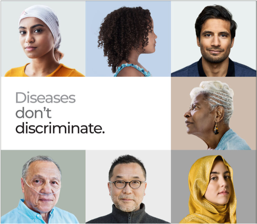

<!-- PROJECT SHIELDS -->
<!--
*** I'm using markdown "reference style" links for readability.
*** Reference links are enclosed in brackets [ ] instead of parentheses ( ).
*** See the bottom of this document for the declaration of the reference variables
*** for contributors-url, forks-url, etc. This is an optional, concise syntax you may use.
*** https://www.markdownguide.org/basic-syntax/#reference-style-links
-->
[![MIT License][license-shield]][license-url]
[![LinkedIn][linkedin-shield]][linkedin-url]

<!-- PROJECT LOGO -->
 

   

  <h3 align="center">Racial Disparity in Medication Prescriptions in MIMIC-III</h3>

  

    <a href="https://mimic.mit.edu"><strong>MIMIC-III »</strong></a>
     
     
    <a href="https://www.linkedin.com/in/jooyeongkang/">Jooyeong Kang</a>
    ・
    <a href="https://www.linkedin.com/in/shruti-hanchinal-547870bb/">Shruti Hanchinal</a>
     
    University of Texas at Austin
    
  

<!-- TABLE OF CONTENTS -->

  
Table of Contents

  <ol>
    <li>
      <a href="#introduction">Introduction</a>
    </li>
    <li><a href="#related-work">Related Work</a></li>
    <li><a href="#methodology">Methodology</a></li>
    <li><a href="#results">Results</a></li>
    <li><a href="#conclusions">Conclusions</a></li>
  </ol>

<!-- INTRODUCTION -->
## Introduction

Many studies have reported racial and ethnic disparities in health care in the United States. Racial and ethnic minorities, like Black, Hispanic, and Asian, are less likely to receive reasonable and appropriate medical care than a racial and ethnic majority, like White. One of the health services where racial and ethnic inequalities occur is medicine prescription. Several cases have identified that the racial and ethnic disparity in prescriptions among those with the same medical conditions results from the gap of insurance coverage between the majority ben- eficiaries and the minority beneficiaries. The minorities are less likely to pay for expensive medicines due to the limited access to full coverage insurance. How- ever, having equal insurance coverage does not guarantee that it reduces the racial and ethnic disparity in prescriptions. A variety of examples have reported that African Americans are less likely than White Americans with the same diagnoses to receive proper medications.

Annually, a large number of people in the U.S. have died due to disparities in medical treatments. During the recent pandemic, COVID-19, the inequalities are getting more transparent. It has been revealed how dysfunctional medical systems in the U.S are with racial and ethnic disparities in health care services. Since diverse communities in the U.S have been promoting racial equity in so- ciety, the development of a monitoring system pursuing fair medical treatments for all racial and ethnic groups becomes necessary. Recently, artificial intelligence technology has actively been introduced to the health care domain. Advanced medical systems with machine learning have supported health care providers to make better decisions for high-quality care. Many people expect the adoption of AI technology to improve medical services with the belief that machines will be more objective and fair than humans. However, bias in machine learning has emerged as a new challenge to solve. Thus, monitoring racial and ethnic in- equalities is critical, particularly in health care systems, because medical tasks are closely associated with human lives and ethics. We believe that identifying racial and ethnic disparities in prescriptions using the MIMIC-III database will contribute to the development of responsible AI medical systems.

<!-- RELATED WORK -->
## Related Work

- Unequal Treatment: Confronting Racial and Ethnic Disparities in Health Care[1]
- Designing and evaluating interventions to eliminate racial and ethnic dispar- ities in health care[2]
- Interventions to Reduce Racial and Ethnic Disparities in Health Care[3]

Stakeholders in the health care domain, like patients, physicians, and pol- icymakers, are well aware of the existence of racial and ethnic disparities in medical treatments and how important it is to cooperate to design responsible medical systems. Also, they have attempted to reduce the inequalities, and rele- vant studies have suggested a variety of recommendations, such as encouraging health care providers to pursue racial and ethnic equity by giving incentives or improving the quality of communications within medical treatment systems. They have also asserted that the use of evidence-based decision-making systems should be required. In terms of patients, they have proposed that patients need to be educated to have the knowledge and understand how they can access and get involved in clinical service decisions through better education and empow- erment programs. Thus, the objective of this project is to suggest a monitoring system that tracks racial and ethnic disparity in medicine prescriptions and helps to reduce the disparity by providing practical communications within the stakeholders.

<!-- METHODOLOGY -->
## Methodology
Our goal was to create a monitoring system that tracks unfair medication pre- scriptions received by racial minorities and informs health care service providers of the occurrence of the disparity by generating regular reports to communi- cate with the stakeholders for managing and keeping medical systems fair. Our prototype was written in Python language, and MIMIC-III(Medical Information Mart for Intensive Care III) database was used that is a large, freely-available database comprising de-identified health-related data associated with over forty thousand patients who stayed in critical care units of the Beth Israel Deaconess Medical Center between 2001 and 2012. The MIMIC-III database consists of 26 tables that have various types of data about patients who stayed in intensive care units.

In this project, three tables were used to investigate racial and ethnic dispar- ity in medication prescriptions: ADMISSIONS having admission records, PA- TIENTS having demographic data, and PRESCRIPTIONS having prescription logs. We cleaned up by removing unnecessary categories and combined these three tables to produce new tables. The new tables comprised only the neces- sary and newly calculated values and patients with the same diagnoses based on the diagnosis category in the ADMISSION table. For example, one of the tables contained only patients who were diagnosed with Pneumonia when they were admitted. We only referred to the top 10 diagnoses that most patients in the MIMIC-III database were diagnosed with, excluding the Newborn category that had few impacts on the disparity. Although we grouped patients based only on diagnosis category to create the new tables, it is available to group patients based on a variety of combinations of different criteria.

The number of drug types is so large, some of which are linked to only one patient, that we grouped patients in each diagnosis table on the basis of the top 10 drugs that most patients were prescribed in each group. We calculated the mean number of each medication prescription per race. The average values were used to identify whether the disparity in the prescriptions among racial groups exists. Racial groups comprised four groups: Whites, Blacks, Hispanic, and Asian. The data distribution was imbalanced according to each racial group since White patients were far more than the other ethnic groups. Therefore, we used a statistical method, Analysis of Variance(ANOVA), to compare the mean values of these four imbalanced racial groups.

   
    
   Fig.1. workflow

<!-- RESULTS -->
## Results

According to the significance values(p-value) calculated through the ANOVA method, the disparity in medication prescriptions among different racial groups existed and varied depending on diagnoses and medications. Although the occur- rences of the disparity were fewer than we thought, we were able to confirm the disparity. In this experiment, only the categories of diagnosis in ADMISSIONS and drug in PRESCRIPTIONS were used to group patients. The addition of different categories, like age, as criteria may be helpful to examine potential disparities in prescriptions with more details. Referring to the reports made by the system, health care providers can take care of patients with appropriate prescriptions, reducing inequality regardless of whether they intend or not.

<!-- CONCLUSIONS -->
## Conclusions

Our project is to design a system that investigates racial and ethnic disparity in medication prescriptions to promote fair health care treatments to all racial groups. The MIMIC-III database was used to build the system, which includes valuable information about medical care received by various types of patients. We explored and preprocessed the database to generate new tables grouped by patients with the same diagnoses and the prescribed medications to disclose the disparity. The statistical method called Analysis of Variance(ANOVA) was used to examine whether the disparity in drug prescriptions between racial majority and minority groups exists on the condition where the number of White patients was more than the ones of the minority groups.
The system we developed has the potential to be a baseline system to evaluate how responsibly the operation of health care systems work. The system can be used to observe racial disparities in other clinical treatments, such as length of stay in ICU or surgery services with respect to racial groups, though further research is needed. We believe that this system can help health care providers to manage patients more efficiently and take care of all patients responsibly, no matter what their ethnicity is.

<!-- REFERENCES -->
## References
1. Nelson, A.: Unequal treatment: confronting racial and ethnic disparities in health care. Journal of the National Medical Association 94(8) (2002) 666
2. Cooper, L.A., Hill, M.N., Powe, N.R.: Designing and evaluating interventions to eliminate racial and ethnic disparities in health care. Journal of general internal medicine 17(6) (2002) 477–486
3. Chin, M.H., Walters, A.E., Cook, S.C., Huang, E.S.: Interventions to reduce racial and ethnic disparities in health care (2007)

<!-- MARKDOWN LINKS & IMAGES -->
<!-- https://www.markdownguide.org/basic-syntax/#reference-style-links -->
[contributors-shield]: https://img.shields.io/github/contributors/othneildrew/Best-README-Template.svg?style=for-the-badge
[contributors-url]: https://github.com/othneildrew/Best-README-Template/graphs/contributors
[forks-shield]: https://img.shields.io/github/forks/othneildrew/Best-README-Template.svg?style=for-the-badge
[forks-url]: https://github.com/othneildrew/Best-README-Template/network/members
[stars-shield]: https://img.shields.io/github/stars/othneildrew/Best-README-Template.svg?style=for-the-badge
[stars-url]: https://github.com/othneildrew/Best-README-Template/stargazers
[issues-shield]: https://img.shields.io/github/issues/othneildrew/Best-README-Template.svg?style=for-the-badge
[issues-url]: https://github.com/othneildrew/Best-README-Template/issues
[license-shield]: https://img.shields.io/github/license/othneildrew/Best-README-Template.svg?style=for-the-badge
[license-url]: https://github.com/othneildrew/Best-README-Template/blob/master/LICENSE.txt
[linkedin-shield]: https://img.shields.io/badge/-LinkedIn-black.svg?style=for-the-badge&logo=linkedin&colorB=555
[linkedin-url]: https://www.linkedin.com/in/jooyeongkang/
[product-screenshot]: images/screenshot.png
